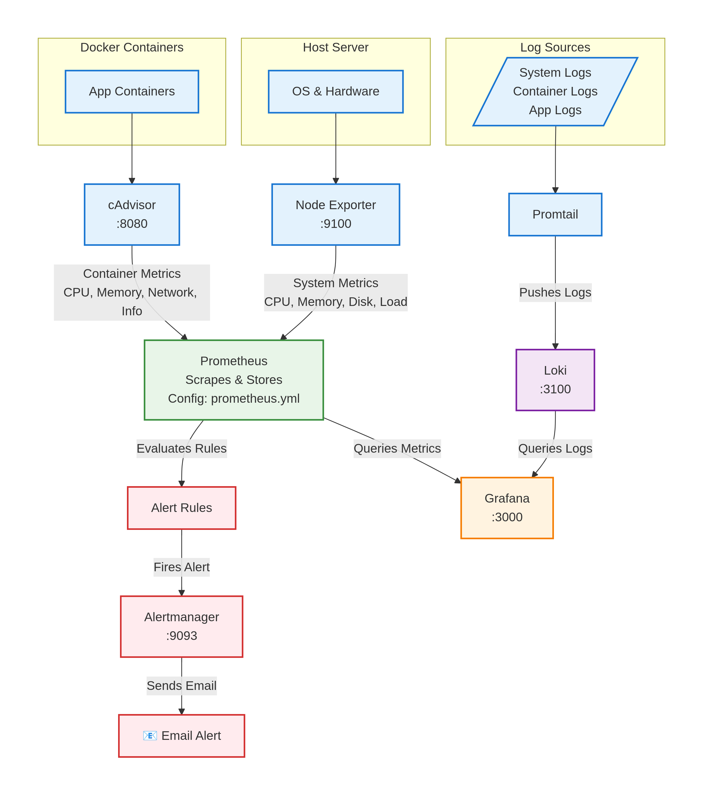

## Rejuve Service Monitoring Workflow

The Rejuve monitoring stack is built using Prometheus, cAdvisor, Node Exporter, Loki, Promtail, Alertmanager, and Grafana. The workflow below summarizes how metrics, logs, and alerts flow through the system.

### 1. Metrics Collection

- Docker Containers

- Application containers expose resource usage.

- cAdvisor (:8080) collects container-level metrics (CPU, memory, network, and container info).

- Host Server

- Node Exporter (:9100) collects system-level metrics (CPU, RAM, disk, load average).

### 2. Metrics Aggregation & Storage

- Prometheus

- Scrapes metrics from cAdvisor and Node Exporter on a scheduled interval.

- Stores all scraped metrics in its time-series database.

- Uses prometheus.yml for configuration.

- Evaluates alerting rules defined in alert rule files.

### 3. Alerting Workflow

- Prometheus evaluates alert rules → when conditions are met, an alert fires.

- Alertmanager (:9093) receives alerts from Prometheus.

- Alertmanager processes routing rules and sends notifications (email, Telegram, Slack, etc.).

- The user receives an Email Alert or other configured notification.

### 4. Log Collection & Storage

- Log Sources

- System logs, container logs, and application logs.

- Promtail

- Reads logs from the host and containers.

- Pushes all logs to Loki.

- Loki (:3100)

- Stores log streams in a highly efficient, index-lite format.
### 5. Visualization & Dashboarding

- Grafana (:3000)

- Queries metrics from Prometheus.

- Queries logs from Loki.

- Combines both into dashboards for real-time monitoring, visualization, and troubleshooting.

